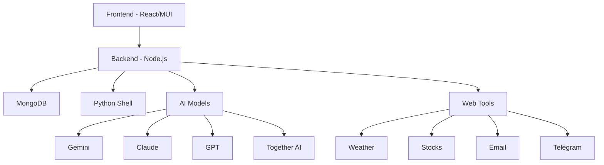

# AllChat - Comprehensive Project Documentation

## Project Overview

AllChat is a sophisticated AI assistant application that integrates multiple AI models (Gemini Pro
1.5, Claude 3, GPT-3.5) with extensive features including chat history, image processing, file
handling, and web tools integration. The project is built using a modern tech stack with React
frontend and Node.js backend.

## Architecture

### High-Level Architecture



### Core Components

1. **Frontend (React/MUI)**

    - User interface components
    - Real-time chat interface
    - File upload handling
    - Authentication
    - Responsive design with Material-UI

2. **Backend (Node.js)**

    - API endpoints
    - Model integration
    - Authentication
    - File processing
    - WebSocket support
    - Scheduling system

3. **Database (MongoDB)**

    - User data
    - Chat history
    - Artifacts storage
    - Custom GPT configurations

4. **Python Shell**
    - Code execution
    - Data processing
    - File generation
    - Scientific computations

## Key Features

### AI Integration

- Multiple AI model support (Gemini, Claude, GPT)
- Custom GPT creation and management
- Image generation (SDXL)
- Code execution
- Memory persistence

### File Handling

- PDF/Word/Excel upload
- Image processing
- File export
- PDF chat export

### Web Tools

- Weather information
- Stock data
- Email integration
- Telegram messaging
- Web search
- YouTube video summary

### User Features

- Multiple chat support
- Chat history
- Message editing
- Markdown formatting
- Mobile responsiveness
- PWA support

## Installation

### Local Development Setup

1. **Prerequisites**

```bash
# Install Node.js dependencies
npm install

# Install Python requirements
pip install -r requirements.txt

# Start MongoDB
docker run -p 27017:27017 -d mongo
```

2. **Environment Configuration** Create `.env` file in server directory:

```env
GOOGLE_KEY=your_google_key
CLAUDE_KEY=your_claude_key
TOGETHER_KEY=your_together_key
JWT_TOKEN=your_jwt_token
OPENWEATHER_API_KEY=your_weather_key
YAHOO_FINANCE_API_KEY=your_finance_key
TELEGRAM_KEY=your_telegram_key
EMAIL=your_email
EMAIL_PASSWORD=your_email_password
```

3. **Running the Application**

```bash
# Start backend
cd server
npm run api

# Start frontend
cd ..
npm run start

# Start Python shell (optional)
cd python-scripts
python shell.py
```

### Docker Deployment

1. **Build Images**

```bash
# Backend
docker build -t allchat-backend ./server

# Frontend
docker build -t allchat-frontend .
```

2. **Deploy with Docker Compose**

```bash
docker-compose up -d
```

## Monitoring

The project includes a comprehensive monitoring solution using:

- Prometheus
- Grafana
- Loki
- Node Exporter

### Monitoring Setup

```bash
cd server/monitoring
docker-compose up -d
```

Access Grafana at `http://localhost:3000`

## Security

- JWT authentication
- HTTPS support
- Rate limiting
- Input validation
- Secure file handling

## API Documentation

The backend exposes RESTful APIs for:

- Authentication
- Chat operations
- File handling
- AI model interactions
- Web tools integration

Detailed API documentation is available in the `rest.http` file.

## Contributing

1. Fork the repository
2. Create a feature branch
3. Commit changes
4. Push to the branch
5. Create a Pull Request

## License

MIT License - See LICENSE file for details

## Support

- GitHub Issues
- Discussions section
- Email support

This documentation provides a comprehensive overview of the AllChat project. For specific
implementation details, refer to the source code and comments within individual components.
