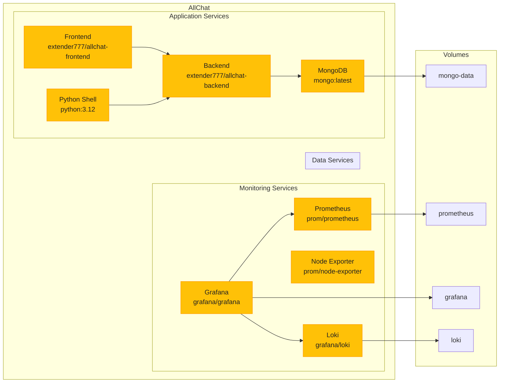
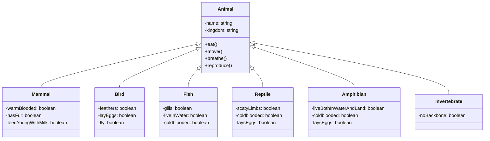

# AllChat

An AI assistant app that interacts with all major models, maintains history, generates and recognizes images, uploads PDFs/Word/Excel files, runs code, makes function calls to models, supports Markdown formatting, and more. Fully written by _Claude 3 Sonnet_.


## Table of Contents

-   [Demo](#demo)
-   [Features](#features)
-   [Connect model to world with Web Tools](#connect-model-to-world-with-web-tools)
-   [Run Locally](#run-locally)
    -   [Environment variables](#environment-variables)
    -   [Run](#run)
-   [Docker Deploy](#docker-deploy)
    -   [Backend (Node.js)](#backend-nodejs)
    -   [Frontend (React MUI)](#frontend-react-mui)
    -   [Running the Containers](#running-the-containers)
-   [Nginx](#nginx)
-   [Monitoring](#monitoring)

## PROD (with $4.99 subscription)

https://allchat.online

[](https://github.com/msveshnikov/allchat)
[](https://opensource.org/licenses/MIT)

<a href="https://www.producthunt.com/posts/allchat-3?utm_source=badge-featured&utm_medium=badge&utm_souce=badge-allchat&#0045;3" target="_blank"></a>

## Features

-   Gemini Pro 1.5, Claude 3 and GPT-3.5
-   Audio Input in Gemini
-   Video Input in Gemini
-   Custom GPTs (best to use with LlaMa-3)
-   Email respond (with attachments, like PDFs, Word, etc)
-   Memory (for Gemini & Claude) - any information about user which you agreed to persist
-   Scheduling any action (hourly or daily) to your email
-   YouTube video summary
-   Image Input (png/jpeg) in Gemini and Claude
-   Image Generation by SDXL
-   Together AI models databricks/dbrx-instruct mistralai/Mixtral-8x22B-Instruct-v0.1, LLama-3, etc
-   File upload PDFs, Word, Excel into the conversation
-   Multiple chats
-   Markdown formatting
-   Edit your messages with response regeneration
-   Python Code Run
-   PDF export of all chats
-   Mobile friendly, PWA, Android app, etc
-   Web Tools - weather, stocks, email send, Telegram, web search, etc - with Gemini, Claude, OpenAI models
-   Please ask for more features in Discussions

## Connect model to world with Web Tools (switch on WebTools option)

-   Instantly run Python code: Just ask AI to write your code and let Python Code Run take care of execution. You can even create pictures or graphs - simply instruct AI to save them to a file. Just say _Create a python program which will draw house and clouds and save to disk_
-   Effortlessly fetch real-time data: Easily access important information such as weather updates, stock prices, and the latest news - _just ask Whats weather in my country?_
-   Automate your email and Telegram correspondences: Send emails effortlessly to yourself or others. Just say _Send information to me_
-   If your task require some compute, Python program will be created and executed in the background. Just say _Calculate first 100 Fibonacci numbers_
-   Get the latest news from Google News in your preferred language and receive them directly in your inbox. Keep up with industry trends and advancements. Just say _Send me your comment about latest news_
-   Create PowerPoint presentations. Just say _Create 10 slides for presentation "Comparison of CZC.cz and Alza.cz" then write a Python program that will save it to disk_ then run code and Save To resulting .pptx link
-   Schedule action and send results to you. Just say _schedule hourly action: generate haiku about spring_
-   Write an email to Assistant <allchatonline.ai@gmail.com> with any inquiry (attachments allowed)

# RUN LOCALLY

## Environment variables

You have to get some of those APIs and set environment variables (or put to .env file in the server folder, you can start with /server/.env.example, rename it to .env):

-   GOOGLE_KEY - Google cloud project name
-   CLAUDE_KEY - Anthropic Key (for Haiku)
-   TOGETHER_KEY - for Together models
-   JWT_TOKEN - any random string
-   OPENWEATHER_API_KEY - for weather tools
-   YAHOO_FINANCE_API_KEY - for stocks tools
-   TELEGRAM_KEY - for Telegram tools to work
-   EMAIL - for email tools
-   EMAIL_PASSWORD - for email tools

## Run

-   Start local Mongo DB (or containerized: `docker run -p 27017:27017 -d mongo`)
-   In the server folder, `npm i` then `npm run api`
-   In the root folder, `npm i` then `npm run start`
-   (Optional) In the python-scripts folder, `python shell.py`

# DOCKER DEPLOY

To containerize the Node.js backend and React MUI frontend for easy deployment, we can use Docker. Here's how you can create Docker containers for your application:

**Backend (Node.js)**

-   Build the Docker image by running the following command in the backend directory:

```
docker build -t allchat-backend .
```

Replace `allchat-backend` with your desired image name. Push to Hub if needed.

**Frontend (React MUI)**

-   Replace ENV REACT_APP_API_URL in the root Dockerfile with your host
-   Build the Docker image by running the following command in the frontend directory:

```
docker build -t allchat-frontend .
```

Replace `allchat-frontend` with your desired image name. Push to Hub if needed.

**Running the Containers**

After building the Docker images, you can run the containers using Docker Compose.

-   Make sure to replace `allchat-backend` and `allchat-frontend` with the names you used when building the Docker images.
-   Put .env file to the same folder as docker-compose.yml
-   Start the containers by running the following command in that folder:

```
docker-compose up
```

This will start both the backend and frontend containers, and the frontend will be accessible at `http://localhost`.

With this setup, you can easily deploy your containerized application to any Docker-compatible environment, such as a cloud platform or a local server.

# NGINX

To configure Nginx as a reverse proxy for your containerized Node.js backend and React MUI frontend applications, you can follow these steps:

1. **Install Nginx**

If Nginx is not already installed on your VM instance, you can install it using the appropriate package manager for your operating system. For example, on Ubuntu or Debian-based distributions, you can run:

```
sudo apt-get update
sudo apt-get install nginx
```

2. **Configure Nginx**

Open the default Nginx configuration file, usually located at `/etc/nginx/nginx.conf` or `/etc/nginx/conf.d/default.conf`. You can use a text editor like `nano` or `vim`.

```
sudo nano /etc/nginx/conf.d/default.conf
```

3. **Configure Server Blocks**

Next, configure the server blocks for your domain. Inside the `http` block, add the following:

```nginx
server {
    server_name allchat.online www.allchat.online;

    location /api/ {
        proxy_pass http://localhost:6000/;
        proxy_set_header Host $host;
        proxy_set_header X-Real-IP       $remote_addr;
        proxy_set_header X-Forwarded-For $proxy_add_x_forwarded_for;
    }

    location / {
        proxy_pass http://localhost:8585;
        proxy_set_header Host $host;
	    proxy_set_header X-Real-IP       $remote_addr;
	    proxy_set_header X-Forwarded-For $proxy_add_x_forwarded_for;
    }

    listen 443 ssl; # managed by Certbot
    ssl_certificate /etc/letsencrypt/live/allchat.online/fullchain.pem; # managed by Certbot
    ssl_certificate_key /etc/letsencrypt/live/allchat.online/privkey.pem; # managed by Certbot
    include /etc/letsencrypt/options-ssl-nginx.conf; # managed by Certbot
    ssl_dhparam /etc/letsencrypt/ssl-dhparams.pem; # managed by Certbot

}

```

This configuration listens on port 80 for requests to `allchat.online` and `www.allchat.online`. It forwards requests to `/api` to your backend container, and all other requests to your frontend container.

5. **Restart Nginx**

Save the changes to the configuration file, and restart Nginx for the changes to take effect:

```
sudo systemctl restart nginx
```

After completing these steps, your Nginx server should now be correctly configured to act as a reverse proxy for your containerized Node.js backend and React MUI frontend applications, serving them at `allchat.online` and `www.allchat.online`.

Note: Make sure that your backend and frontend containers are running and accessible from your Nginx server. You may need to adjust the firewall rules or security groups on your VM instance to allow incoming traffic on the necessary ports.

# Monitoring

Check /server/monitoring folder for dockerized monitoring solution (Loki+Grafana)





[](https://github.com/msveshnikov/allchat/stargazers)

[](https://github.com/msveshnikov/allchat/network/members)

# TODO

[x] other user avatars, not always mine
[x] custom GPT avatar auto create
[x] shared chat manager for owners
[x] broadcast update of shared chat - WebSockets
[x] Coins and Achievments
[x] Artifacts
[x] Sonnet 3.5
[ ] bio in profile?