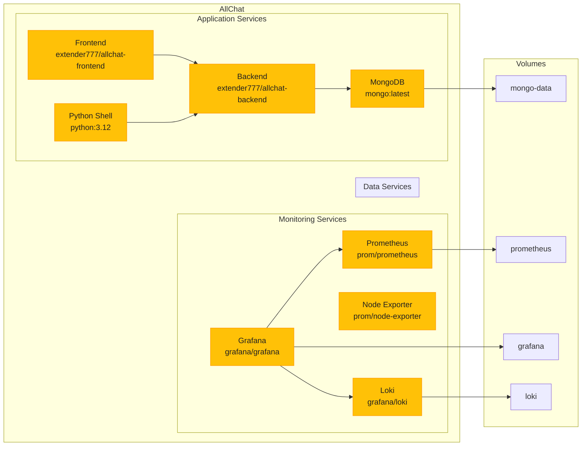
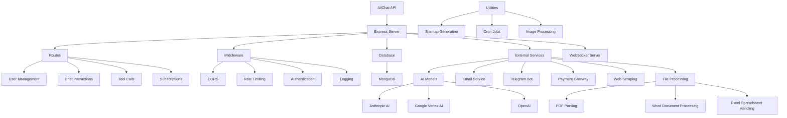

# AllChat (built by [AutoCode](https://autocode.work))

An AI assistant app that interacts with all major models, maintains history, generates and recognizes images, uploads PDFs/Word/Excel files, runs code, makes function calls to models, supports Markdown formatting, and more. Fully written by _Claude 3 Sonnet_.

## Table of Contents

-   [Demo](#demo)
-   [Features](#features)
-   [Connect model to world with Web Tools](#connect-model-to-world-with-web-tools)
-   [Run Locally](#run-locally)
    -   [Environment variables](#environment-variables)
    -   [Run](#run)

## PROD (with $4.99 subscription)

https://allchat.online

## Features

-   Gemini Pro 1.5, Claude 3.5 and GPT-4o
-   Artifacts
-   Avatar Builder
-   Shared Chats
-   Achievements
-   Audio Input in Gemini
-   Video Input in Gemini
-   Custom GPTs
-   Email respond (with attachments, like PDFs, Word, etc)
-   Memory - any information about user which you agreed to persist
-   Scheduling any action (hourly or daily) to your email
-   YouTube video summary
-   Image Input (png/jpeg) in Gemini and Claude
-   Image Generation by SDXL
-   Together AI models databricks/dbrx-instruct mistralai/Mixtral-8x22B-Instruct-v0.1, LLama-3, etc
-   File upload PDFs, Word, Excel into the conversation
-   Multiple chats
-   Markdown formatting
-   Edit your messages with response regeneration
-   Python Code Run
-   PDF export of all chats
-   Mobile friendly, PWA, Android app, etc
-   Web Tools - weather, stocks, email send, Telegram, web search, etc - with Gemini, Claude, OpenAI models
-   Please ask for more features in Discussions

## Connect model to world with Web Tools (switch on WebTools option)

-   Instantly run Python code: Just ask AI to write your code and let Python Code Run take care of execution. You can even create pictures or graphs - simply instruct AI to save them to a file. Just say _Create a python program which will draw house and clouds and save to disk_
-   Effortlessly fetch real-time data: Easily access important information such as weather updates, stock prices, and the latest news - _just ask Whats weather in my country?_
-   Automate your email and Telegram correspondences: Send emails effortlessly to yourself or others. Just say _Send information to me_
-   If your task require some compute, Python program will be created and executed in the background. Just say _Calculate first 100 Fibonacci numbers_
-   Get the latest news from Google News in your preferred language and receive them directly in your inbox. Keep up with industry trends and advancements. Just say _Send me your comment about latest news_
-   Create PowerPoint presentations. Just say _Create 10 slides for presentation "Comparison of CZC.cz and Alza.cz" then write a Python program that will save it to disk_ then run code and Save To resulting .pptx link
-   Schedule action and send results to you. Just say _schedule hourly action: generate haiku about spring_
-   Write an email to Assistant <allchatonline.ai@gmail.com> with any inquiry (attachments allowed)

# RUN LOCALLY

## Environment variables

You have to get some of those APIs and set environment variables (or put to .env file in the server folder, you can start with /server/.env.example, rename it to .env):

-   GOOGLE_KEY - Google cloud project name
-   CLAUDE_KEY - Anthropic Key (for Haiku)
-   TOGETHER_KEY - for Together models
-   JWT_TOKEN - any random string
-   OPENWEATHER_API_KEY - for weather tools
-   YAHOO_FINANCE_API_KEY - for stocks tools
-   TELEGRAM_KEY - for Telegram tools to work
-   EMAIL - for email tools
-   EMAIL_PASSWORD - for email tools

## Run

-   Start local Mongo DB (or containerized: `docker run -p 27017:27017 -d mongo`)
-   In the server folder, `npm i` then `npm run api`
-   In the root folder, `npm i` then `npm run start`

## Star History

# TODO

[x] other user avatars, not always mine

[x] custom GPT avatar auto create

[x] shared chat manager for owners

[x] broadcast update of shared chat - WebSockets

[x] Coins and Achievements

[x] Artifacts

[x] Sonnet 3.5

[x] OpenSCAD models

[x] React type artifacts

[x] Custom GPT Shop
